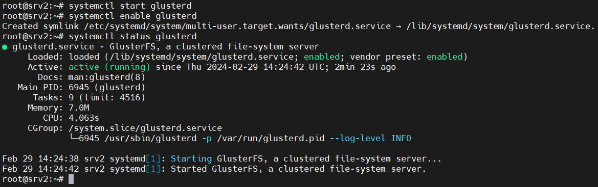
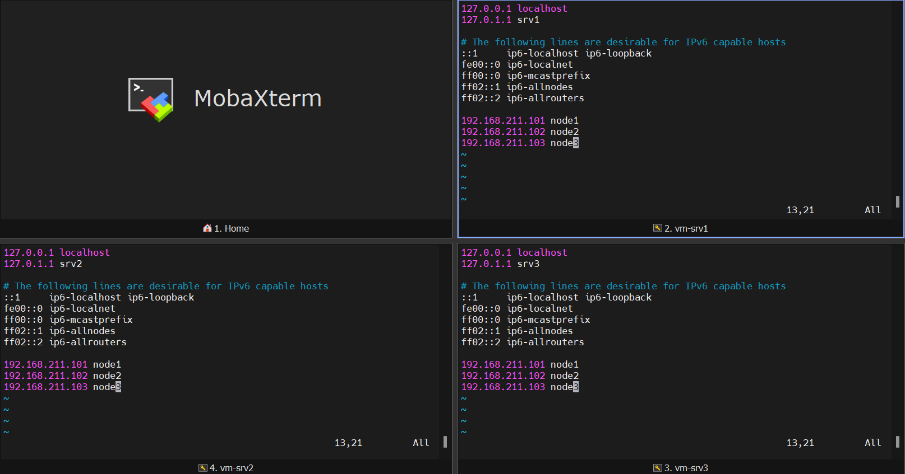
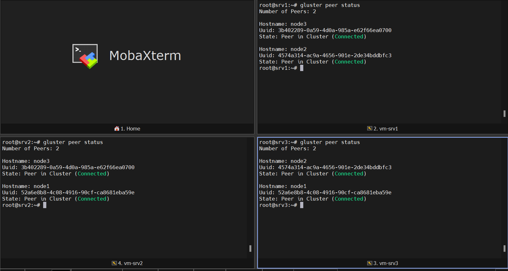
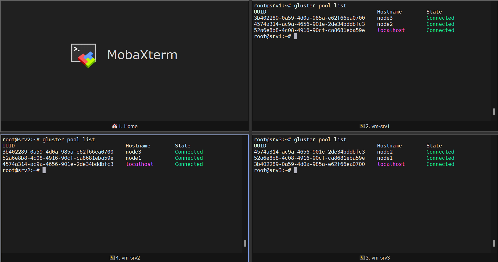

# Setup GlusterFS

## Configuration lvm

Create a new volume group, create a logical volume and mount it on the external hard disk.

```bash
pvcreate /dev/sdb
vgcreate glustervg /dev/sdb
lvcreate -l 100%VG -n glusterlv glustervg
```

## Create GlusterFS Storage

To create a GlusterFS storage, you will need an external hard disk on each server.<br>
You will also need to create a partition on an external hard disk(/dev/sdb) on each server.

```bash
mkfs.ext4 /dev/glustervg/glusterlv
mkdir /glustervolume
mount /dev/glustervg/glusterlv /glustervolume
vim /etc/fstab

/dev/glustervg/glusterlv /glustervolume ext4 defaults 0 0
/dev/disk/by-uuid/938da461-1842-4928-94f7-f098f0e87e1d /glustervolume ext4 defaults 0 0

mount -a
df -h
```

## Install GlusterFS

For this task you will need 3 ubuntu servers.

Run these commands on all three servers:

```bash
apt-get update
apt-get install -y software-properties-common
add-apt-repository ppa:gluster/glusterfs-7 # Don't need to add because it's default repository
apt-get update
apt install glusterfs-server
```
> **NOTE:** If you faces an **error** like this (Temporary failure resolving 'ir.archive.ubuntu.com') in last commands, do this:
> ```bash
> vim /etc/resolve.conf
>
> nameserver 8.8.8.8
> ```
> then try again.

> **NOTE:** `glusterfs-client` is installed with the last `apt install` command.

after the installation start, enable and check status of GlusterFS with theses commands:

```bash
systemctl start glusterd
systemctl enable glusterd
systemctl status glusterd
```




## Update 

We need to update `host` file because we're using private IPs.

```bash
vim /etc/hosts

192.168.178.11 gl1
192.168.178.12 gl2
192.168.178.13 gl3
```


## Configure GlusterFS Volume

Now it's time to connect our servers. Run these command on your first node.

```bash
gluster peer probe gl2
gluster peer probe gl3
gluster peer status
```



To verify the added storage pool with the following command:

```bash
gluster pool list
```


## Setup volumes

Create a brick directory on each node with the following command:

```bash
mkdir /glustervolume/vol1
```

Then create a volume named vol1 with three replicas by these commands on your primary server:

```bash
gluster volume create vol1 replica 3 gl1:/glustervolume/vol1 gl2:/glustervolume/vol1 gl3:/glustervolume/vol1
gluster volume start vol1
gluster volume status
```


## Mounting GlusterFS on Clients

## Update /etc/hosts

We need to update `host` file because we're using private IPs.

```bash
vim /etc/hosts

192.168.178.11 gl1
192.168.178.12 gl2
192.168.178.13 gl3
```

Install package glusterfs-client on all client machines.

```bash
apt-get update
apt-get install -y software-properties-common
add-apt-repository ppa:gluster/glusterfs-7
apt-get update
apt install glusterfs-client
```

Create a directory where you want to mount the GlusterFS volume on your client machine:

```bash
mkdir /mnt/vol1
echo "gl3:/vol1 /mnt/vol1 glusterfs defaults 0 0" >> /etc/fstab
mount -a
```

## Time to test

Make a file in one of the servers and check other to see the file you've made.

```bash
# Do this on the first server
touch /mnt/vol1/file1.txt
vim /mnt/vol1/file1.txt

Hello World!
```


## Author

[Sanaz Sadr](https://github.com/SanazSadr)

## Source of content

[How to Install and Configure GlusterFS on Ubuntu 22.04](https://www.howtoforge.com/how-to-install-and-configure-glusterfs-on-ubuntu-22-04/) <br>
[How To Install GlusterFS on Ubuntu 22.04 LTS](https://idroot.us/install-glusterfs-ubuntu-22-04/) <br>
[How to Setup GlusterFS in Ubuntu](https://www.youtube.com/watch?v=gEG7Eu320Rk)