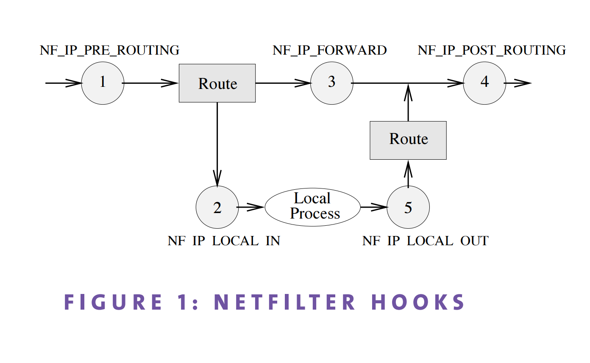
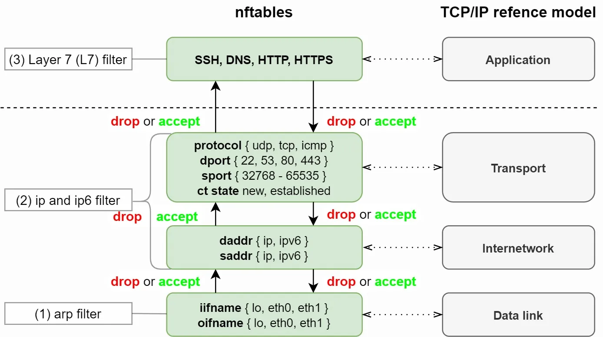

# nftables

nftables is a tool that can help you to manage your firewall. it's a `netfilter` framework.

In kernel and nftables we have a object called `hook` that is a point in the packet processing where we can attach rules.

The hooks are:
- `NF_IP_PRE_ROUTING`: before routing decision (for destination nat and so on)
- `NF_IP_LOCAL_IN`: for packets destined to local sockets (designated for local linux like ssh, httpd and so on)
- `NF_IP_FORWARD`: for packets being routed through the machine (like a router)
- `NF_IP_POST_ROUTING`: for packets leaving the machine (after routing decision, src nat and so on)
- `NF_IP_LOCAL_OUT`: for packets generated locally (like answers to ping, or http requests)

nftables is a replacement for `iptables`, `ip6tables`, `arptables` and `ebtables`. It uses a single tool to manage both IPv4 and IPv6 rules.

### Packet flow

If packet want to route through the machine it goes through `NF_IP_PRE_ROUTING`, `NF_IP_FORWARD` and `NF_IP_POST_ROUTING` hooks.(for example linux is a router)

If packet is destined to local machine it goes through `NF_IP_PRE_ROUTING`, `NF_IP_LOCAL_IN` hooks.(for example ssh connection to the machine)

If packet is generated locally it goes through `NF_IP_LOCAL_OUT` and `NF_IP_POST_ROUTING` hooks.(for example answer to ping or a http request)



**nftables can work in `data link layer`, `network layer` and `transport layer`. you can filter packets based on mac address, ip address and port.**



### Tables

Tables are containers for chains for packets filtering. you can create multiple tables for different protocols. for example you can create a table for `ip` protocol and another table for `ip6` protocol. you can also create a table for `bridge` protocol.

**In nftables we don't have any tables by default. you have to create them manually**

Ok, let's jump to terminal and practice nftables :)

Install nftables package:

```bash
sudo apt install nftables
```

`man nft` to see nftables manual.

To see example configuration files:

```bash
dpkg -L nftables | grep examples
```

#### To work with nftables we have three ways:

- `script file`: you can create a script file and load it with `nft -f <file>` (cat /etc/nftables.conf) and then you can use `nft list ruleset` to see the rules.
- `command line`: you can use `nft` command to manage your firewall. for example `nft add table ip filter` to create a table named filter for ip protocol or `nft add ...`.
- `interactive mode`: you can use `nft -i` command to enter interactive mode and then you can type commands to manage your firewall.

#### nftables address families

`nft` has different address families:
- `ip`: for ipv4 protocol
- `ip6`: for ipv6 protocol
- `inet`: for both ipv4 and ipv6 protocols
- `arp`: for arp protocol
- `bridge`: for bridge protocol
- `netdev`: for netdev protocol (for ingress filtering)

Let's look at the default configuration of nftables:

```bash
root@gw:~# nft list ruleset
table inet filter {
	chain input {
		type filter hook input priority filter; policy accept;
	}

	chain forward {
		type filter hook forward priority filter; policy accept;
	}

	chain output {
		type filter hook output priority filter; policy accept;
	}
}
root@gw:~# 
```

For print the priority as number use `-y` option:

```bash
root@gw:~# nft -y list ruleset
table inet filter {
	chain input {
		type filter hook input priority 0; policy accept;
	}

	chain forward {
		type filter hook forward priority 0; policy accept;
	}

	chain output {
		type filter hook output priority 0; policy accept;
	}
}
root@gw:~# 
```

let's create a table:

```bash
root@gw:~# nft flush ruleset
root@gw:~# nft add table inet filter
root@gw:~# nft list ruleset
table inet filter {
}
root@gw:~# 
```

let's create a chain in the table:

```bash
root@gw:~# nft add chain inet filter input
root@gw:~# nft list ruleset
table inet filter {
    chain input {
    }
}
root@gw:~#
```

funny thing is that if you run `iptables` command it work with nftables in background :)

```bash
root@gw:~# nft flush ruleset
root@gw:~# nft list ruleset

root@gw:~# iptables -t filter -N test
root@gw:~# nft list ruleset
table ip filter {
	chain ssh {
	}
}

root@gw:~#
root@gw:~# iptables -t filter -A INPUT -p tcp --dport 22 -j ACCEPT
root@gw:~# nft -y list ruleset
table ip filter {
	chain ssh {
	}

	chain INPUT {
		type filter hook input priority 0; policy accept;
		tcp dport 22 counter packets 217 bytes 18952 accept
	}
}
```

let's create a chain with hook and priority:

```bash
root@gw:~# nft flush ruleset
root@gw:~# nft add table inet filter
root@gw:~# nft add chain inet filter input { type filter hook input priority 0 \; }
root@gw:~# nft list ruleset
table inet filter {
    chain input {
        type filter hook input priority 0; policy accept;
    }
}
root@gw:~#
```

let's open ssh port for [rfc1918](https://datatracker.ietf.org/doc/html/rfc1918)

```bash
root@gw:~# nft -f /etc/nftables.conf
root@gw:~# nft list ruleset
root@gw:~# nft add rule inet filter input ip saddr { 192.168.0.0/16, 172.16.0.0/12, 10.0.0.0/8 } tcp dport 22 counter accept
```

Add a rule and delete it:

```bash
root@gw:~# nft add rule inet filter input tcp dport 22 log prefix \"SSH connection: \" counter accept
```

For delete a rule you have to know its handle:

```bash
root@gw:~# nft -a list ruleset
table inet filter { # handle 6
	chain input { # handle 1
		type filter hook input priority filter; policy accept;
		ip saddr { 10.0.0.0/8, 172.16.0.0/12, 192.168.0.0/16 } tcp dport 22 counter packets 4485 bytes 393836 accept # handle 3
		tcp dport 22 log prefix "SSH connection: " counter packets 0 bytes 0 accept # handle 7
	}
}
```

we can delete the rule with its handle
**handle is allways is fixed even if you delete a rule**

```bash
root@gw:~# nft delete rule inet filter input handle 7
root@gw:~# nft -a list ruleset
```

### Inserting rules
You can insert rules at the top of the chain with `insert` command and you can insert rules in specific position with `position <num>` command.

```bash
root@gw:~# nft insert rule inet filter input tcp dport 80 counter accept
root@gw:~# nft -ay list ruleset
root@gw:~# nft insert rule inet filter input position 5 tcp dport 443 counter accept # before position 5
root@gw:~# nft -ay list ruleset
root@gw:~# nft add rule inet filter input position 5 tcp dport 443 counter accept # after position 5
root@gw:~# nft -ay list ruleset
```

### add rule for log ssh connection attempts

```bash
root@gw:~# nft insert rule inet filter input tcp dport 22 log prefix \"SSH connection: \" counter accept
root@gw:~# nft -ay list ruleset
```

### Stateful firewall

To create a stateful firewall we have to use `ct` (connection tracking) module of nftables.

The posible states defined for a connection are:

* `NEW`: the packet is starting a new connection
* `ESTABLISHED`: the packet is part of an existing connection (two way communication)
* `RELATED`: This is expected connection, it's related to an established connection, like an ftp data connection(ftp control command on port 20, 21 and ftp data connection)
* `INVALID`: the packet is not associated with any known connection, or the state could not be determined.

#### Example: let's log ssh new connection attempts

```bash
root@gw:~# nft flush ruleset
root@gw:~# nft -f /etc/nftables.conf
root@gw:~# nft insert rule inet filter input ct state established accept # accept established connections
root@gw:~# nft insert rule inet filter input tcp dport 22 ct state new log prefix \"New SSH connection: \" counter accept
root@gw:~# nft -ay list ruleset
```

#### Example: let's allow http and https connections and set comment.

```bash
root@gw:~# nft insert rule inet filter input tcp dport { 80, 443 } comment \"Allow http and https connections\" accept
root@gw:~# nft -ay list ruleset
```

#### Replace a rule

For replace a rule you have to know the handle of the rule:

```bash
root@gw:~# nft -ay list ruleset
root@gw:~# nft replace rule inet filter input handle 3 tcp dport { 80, 443 } comment \"Allow http and https connections\" counter accept
root@gw:~# nft -ay list ruleset
```

# ICMP allow

```bash
root@gw:~# nft insert rule inet filter input ip protocol icmp accept
root@gw:~# nft -ay list ruleset
```


