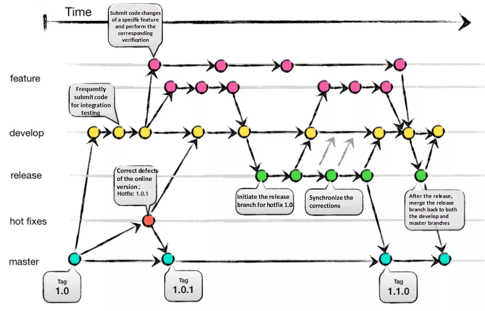

### Git area

In Git, there are three main areas:

* Working Directory: This is where you have your actual project files. It is the directory on your local machine where you make changes to your code.

* Staging Area (also known as the Index): This is an intermediate area between the working directory and the repository. After making changes to your code in the working directory, you can selectively add those changes to the staging area using the git add command. The staging area allows you to choose which changes you want to include in the next commit. Managed with the `git add` command.

* Repository: This is where Git stores the history of your project. It contains all the committed versions of your code. Once you have added changes to the staging area, you can commit them to the repository using the git commit command. Commits in the repository are permanent and can be referenced by a unique identifier (commit hash). Managed with the `git commit` command.

### Git init

`git init` is a command used to create a new Git repository. When you run this command in a directory, it initializes a new empty repository in that directory. This means that Git will start tracking changes to files in that directory and allow you to commit those changes to the repository's history.

```bash
git init
```

#### git add

`git add` is a command used in Git to add changes from the working directory to the staging area. It allows you to selectively choose which changes you want to include in the next commit.

`git add file_name`: This command adds a specific file to the staging area. For example, `git add main.py` adds the `main.py` file to the staging area.

`git add .`: This command adds all changes in the current directory and its subdirectories to the staging area. It is a convenient way to add multiple files at once.

After using `git add`, the changes are staged and ready to be committed. You can then use `git commit` to create a new commit with the staged changes.

### Git branch

In Git, a branch is a lightweight movable pointer to a commit. It is used to track the progress of different lines of development. Branches in Git are useful for creating new features, bug fixes, or experiments without affecting the main codebase. You can create, switch between, merge, and delete branches in Git.

To create a new branch in Git, you can use the git branch command followed by the name of the new branch. Here's the syntax:

```bash
git branch <branch_name>
git branch feature-branch
```

After creating the branch, you can switch to it using the `git checkout` command:

```bash
git checkout feature-branch
```

Alternatively, you can create and switch to a new branch in a single command using the `-b` flag:

```bash
git checkout -b feature-branch
```
