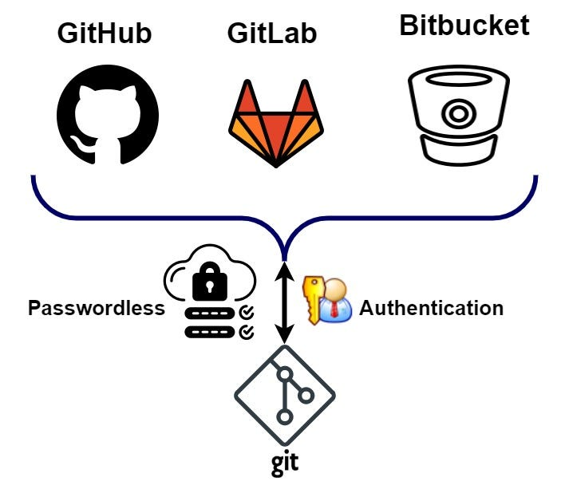

### Git clone

- Clone a repository
- Create a new repository
- Push to a remote repository
- Pull from a remote repository
- Fetch from a remote repository

`git clone` is a command used to create a copy of a remote Git repository on your local machine. It allows you to download all the files and commit history from the remote repository.

To clone a repository, you need the URL of the remote repository. For example, if you want to clone a repository from GitHub, you can find the URL on the repository's page. Once you have the URL, open your terminal or command prompt and run the following command:

```bash
git clone <repository_url>
```

Push the changes to the remote repository using the `git push` command. Specify the name of the remote repository and the branch you want to push. For example, to push the changes to the "main" branch:

```bash
git push origin main
```

If the branch doesn't exist in the remote repository, Git will create it for you.

To pull changes from a remote repository into your local repository, you can follow these steps:

```bash
git pull origin <branch_name>
```


```bash
git pull origin main
```

To fetch changes from a remote repository into your local repository without automatically merging them

```bash
git fetch origin main
```

After fetching the changes, you can view the updated branches and commits in your local repository. You can use commands like `git branch -r` and `git log` to list the remote branches or `git log origin/main` to see the commit history of the remote branch named "main"

