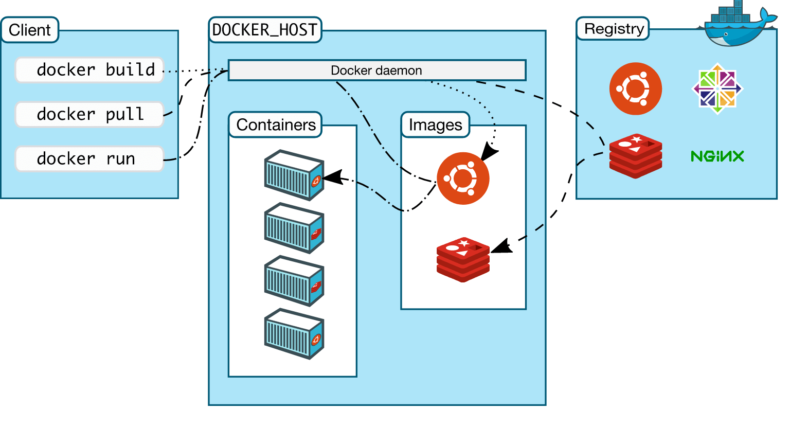

## Docker Engine

Docker Engine is at the core of the Docker system. When installing Docker on our device, we usually set up two components: the Docker Command Line Interface (CLI) and Docker Daemon.

**Server:** A long-running program called a daemon process (the dockerd command).

**REST API:** An interface that programs can use to talk to the daemon and instruct it what to do.

**Command Line Interface (CLI):** A command-line tool (docker) that allows users to interact with Docker daemons through the Docker API.

Docker Engine is the core component of Docker, a popular containerization platform. It's a client-server application with three major components:

Server: A long-running program called a daemon process (the dockerd command).

REST API: An interface that programs can use to talk to the daemon and instruct it what to do.

Command Line Interface (CLI): A command-line tool (docker) that allows users to interact with Docker daemons through the Docker API.

Here's a more detailed look at these components:

**Docker Daemon (dockerd):** The Docker daemon listens for Docker API requests and manages Docker objects such as images, containers, networks, and volumes. It can also communicate with other Docker daemons to manage Docker services.

**REST API:** The Docker REST API provides a way for applications to interact programmatically with the Docker daemon. It can be used to control almost every aspect of Docker, from creating and managing containers to handling storage and networks.

**CLI (docker):** The Docker CLI client provides a command-line interface that users can use to interact with Docker. When you use commands such as docker run, the client sends these commands to dockerd, which carries them out.

## Docker Architecture

Docker's architecture is designed to facilitate containerization, a method of packaging an application and its dependencies together in a container. This architecture is composed of several key components:

1. **Docker Daemon**: 
   - The Docker daemon (`dockerd`) runs on the host machine. It's responsible for creating, running, and managing Docker containers. The daemon listens for Docker API requests and can communicate with other daemons to manage Docker services.

2. **Docker Client**:
   - The Docker client (`docker`) is the primary way most Docker users interact with Docker. When you run commands such as `docker run`, the client sends these commands to `dockerd`, which carries them out. The Docker client can communicate with more than one daemon.

3. **Docker Registries**:
   - Docker registries store Docker images. Docker Hub is a public registry that anyone can use, and Docker is configured to look for images on Docker Hub by default. Users can also run their own private registry. When you use the `docker pull` or `docker run` commands, the required images are pulled from your configured registry. When you use `docker push`, your image is pushed to your configured registry.

4. **Docker Objects**:
   - When using Docker, you are creating and using images, containers, networks, volumes, plugins, and other objects. Here’s a brief overview:
     - **Images**: An image is a read-only template with instructions for creating a Docker container. Often, an image is based on another image, with some additional customization.
     - **Containers**: A container is a runnable instance of an image. You can create, start, stop, move, or delete a container using the Docker API or CLI. You can connect a container to one or more networks, attach storage to it, or even create a new image based on its current state.
     - **Networks**: Docker networking allows you to attach a container to as many networks as you like. Docker also provides drivers for different types of networks (like bridge, overlay, etc.) which you can use to leverage different networking capabilities.
     - **Volumes**: Docker volumes are the preferred mechanism for persisting data generated by and used by Docker containers.

5. **Docker Compose**:
   - Docker Compose is a tool for defining and running multi-container Docker applications. With Compose, you use a YAML file to configure your application’s services, networks, and volumes, and then create and start all the services from your configuration with a single command.

6. **Docker Swarm**:
   - Docker Swarm is a tool for Docker container orchestration. It allows you to manage a cluster of Docker hosts, and deploy and manage applications across those hosts.

This architecture promotes Docker's major goals: efficiency, portability, and ease of deployment. By isolating applications from the host system and from each other, Docker provides a lightweight form of virtualization, facilitating rapid deployment and scaling of applications, and ensuring that they run consistently across different environments.

# Docker container

Docker container is a lightweight, standalone, executable package that includes everything needed to run a piece of software, including the code, runtime, system tools, libraries, and settings.

Key features of Docker containers include:

1. **Portability**: Since a Docker container includes the application and all of its dependencies, it can run seamlessly across any machine that has Docker installed, regardless of the underlying operating system.

2. **Isolation**: Containers are isolated from each other and the host system. This ensures that each container has its own resources, and its performance is not affected by other containers.

3. **Resource Efficiency**: Containers share the host system's kernel, but can be limited to use a certain amount of resources like CPU and memory. They are generally more lightweight than traditional virtual machines.

4. **Consistency**: Docker containers ensure consistency across multiple development, testing, and production environments. This helps in reducing the “it works on my machine” problem in software development.

5. **Scalability and Modularity**: Containers can be easily scaled up or down and can be used as part of microservices architecture, where each service is encapsulated in its own container.

6. **Rapid Deployment**: Containers can be started, stopped, and replicated quickly, which is beneficial in continuous integration and continuous deployment (CI/CD) workflows.

In summary, Docker containers offer a convenient and efficient way to package and distribute applications, ensuring that they work uniformly and reliably regardless of where they are deployed.