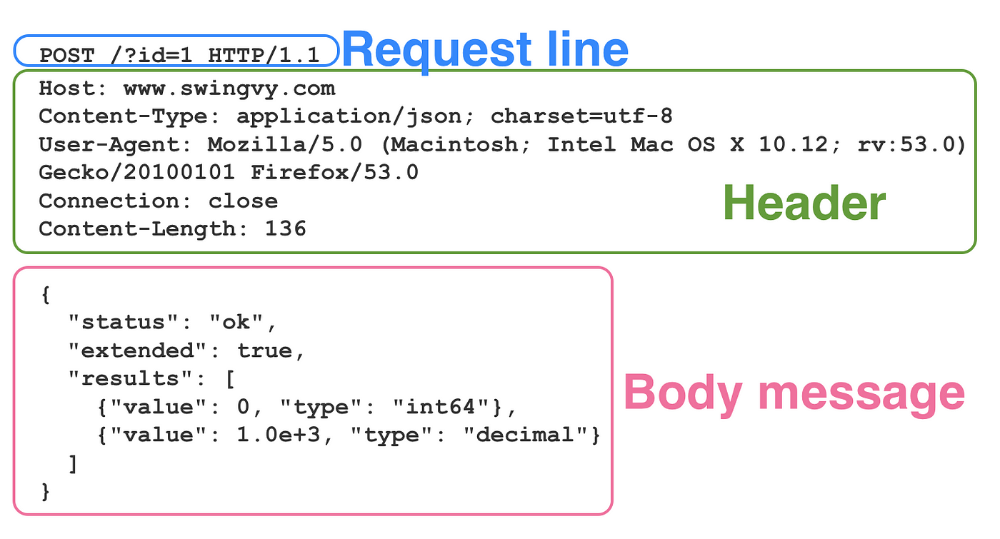
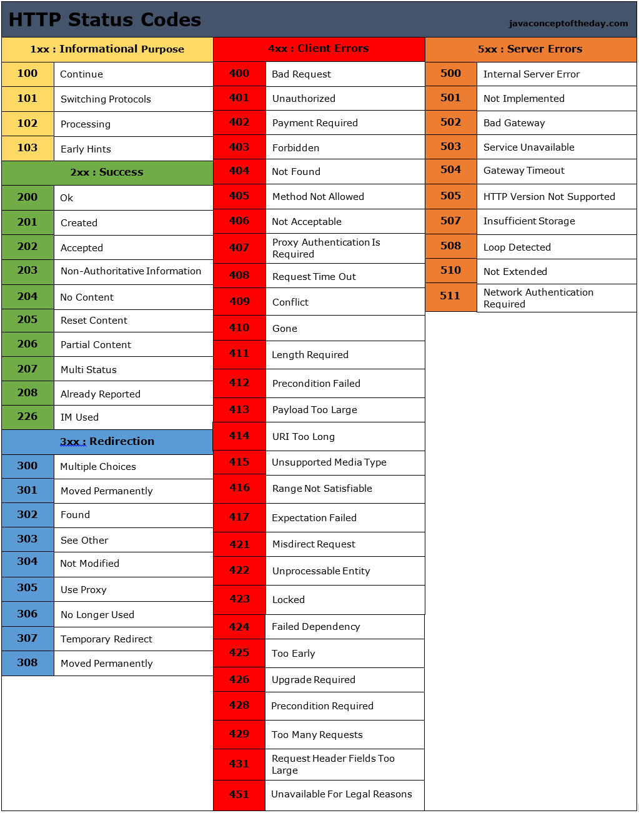

### What is REST API

A REST API (Representational State Transfer Application Programming Interface) is a set of rules and standards that allows different software applications to communicate over the internet. REST APIs enable different systems to exchange data and perform operations across a network in a standardized way. Here are the key characteristics and components of a REST API:

1. **Statelessness**: Each request from a client to a server must contain all the information needed to understand and process the request. The server does not store any session information about the client.

2. **Client-Server Architecture**: The client and the server are separate entities, and each can evolve independently. This separation of concerns supports the scalability of the server's components.

3. **Uniform Interface**: A uniform interface simplifies and decouples the architecture, which enables each part to evolve independently. The four guiding principles of the uniform interface are:
   - Resource Identification in Requests: Individual resources are identified in requests, for example using URIs (Uniform Resource Identifiers) in web-based REST systems.
   - Resource Manipulation through Representations: When a client holds a representation of a resource, including any metadata attached, it has enough information to modify or delete the resource.
   - Self-descriptive Messages: Each message includes enough information to describe how to process it.
   - Hypermedia as the Engine of Application State (HATEOAS): Clients interact with a REST API entirely through the hypermedia provided dynamically by application servers.

4. **Layered System**: A client cannot ordinarily tell whether it is connected directly to the end server or to an intermediary along the way.

5. **Code on Demand (optional)**: Servers can temporarily extend or customize the functionality of a client by transferring executable code.

6. **Methods of Request and Response**: REST uses a set of well-defined methods (like GET, POST, PUT, DELETE) to perform operations on resources. These methods correspond to create, read, update, and delete (CRUD) operations.

7. **Data Formats**: REST APIs commonly use formats like JSON (JavaScript Object Notation) or XML (eXtensible Markup Language) for data exchange.

REST APIs are widely used in web services development due to their simplicity, scalability, and flexibility. They are particularly useful in cloud services, mobile application development, and creating web-based APIs for internet services.

In computing, applications can be categorized as either stateful or stateless, based on how they manage information about the user's interaction with the system. Here's an overview of each:

### Stateful Applications

1. **Definition**: Stateful applications retain user state and session information over time and across different user interactions. This means that the application remembers the state of interaction from one session to the next.

2. **Characteristics**:
    - **Session Management**: Stateful applications manage user sessions, keeping track of the user's history and context.
    - **Data Storage**: They typically store state information either on the server, in the user's browser (like cookies), or other client-side storage.
    - **Interaction**: Each user interaction is dependent on the state from previous interactions. For example, an online shopping cart remembers what items you've added in previous visits.
    - **Complexity**: Managing state can add complexity to the application, particularly in terms of scalability and persistence.

3. **Use Cases**: Online shopping websites, web applications that require user authentication and maintain user preferences, and applications where the user's previous interactions affect subsequent ones.

### Stateless Applications

1. **Definition**: Stateless applications do not store any data about the user's session on the server. Each request from the client must contain all the necessary information for the server to understand and process it.

2. **Characteristics**:
    - **No Session Memory**: The server does not remember anything about the user once the interaction ends. Each request is treated as new.
    - **Scalability**: Stateless applications can be more scalable because there is no need to synchronize session state across multiple servers.
    - **Simplicity and Efficiency**: They are generally simpler and more efficient, as they do not need to manage and persist session state.

3. **Use Cases**: RESTful APIs are a primary example, where each HTTP request contains all necessary information independently. Other examples include stateless microservices and functions-as-a-service (FaaS) in cloud computing.

### Comparison

- **Scalability**: Stateless applications are easier to scale since there is no session data to manage across multiple servers.
- **Performance**: Stateful applications can offer a more personalized experience but may require more resources and complexity to manage the state.
- **Development and Maintenance**: Stateless applications are simpler to develop and maintain due to the lack of dependency on previous interactions.
- **Suitability**: The choice between stateful and stateless depends on the specific needs of the application. For example, a shopping cart application benefits from being stateful, whereas a public API might be better off stateless for scalability and simplicity.

Understanding the differences between stateful and stateless applications is crucial for architects and developers, as it affects the design, scalability, and user experience of the software.

### Resource

In the context of a REST (Representational State Transfer) API, a "resource" is a fundamental concept. It refers to any type of object, data, or service that can be accessed by the client. A resource is identified by a URI (Uniform Resource Identifier) and can be manipulated using a standard set of methods (like GET, POST, PUT, DELETE). Here's a more detailed look at resources in REST APIs:

### Definition of a Resource

1. **Entity**: A resource can be any kind of entity that the API can provide information about. This could be a physical object, a document, an abstract concept, or a collection of other resources.
2. **URI Identification**: Each resource is uniquely identified by a URI. For instance, in a REST API for a book store, the URI `/books/123` might represent a specific book with the identifier 123.

### Characteristics of Resources

1. **Representation-Independent**: A resource can have different representations, such as JSON, XML, HTML, or even plain text. The server may provide and accept different formats, and it's often up to the client to specify the desired format through HTTP headers.
2. **Stateless Interactions**: Each request for a resource contains all the information needed for the server to process it. The server does not store the client's session state.
3. **Manipulation Through Standard HTTP Methods**:
    - **GET**: Retrieve the current state of a resource.
    - **POST**: Create a new resource or perform a complex operation.
    - **PUT**: Update an existing resource.
    - **DELETE**: Remove a resource.
    - **PATCH**: Partially update an existing resource.

### Examples of Resources

- **Data Entities**: In a social media API, resources might include individual users, posts, comments, or images.
- **Collections**: A resource can also be a collection of other resources. For example, `/users` might represent all users in a system.
- **Services**: Some resources represent services, like a resource for processing payments or generating reports.

### Resource Lifecycle

1. **Creation**: A resource can be created using a POST or PUT request.
2. **Reading**: Accessing the resource typically via a GET request.
3. **Updating**: Modifying the resource through PUT or PATCH requests.
4. **Deletion**: Removing the resource with a DELETE request.

### Design Principles

- **Uniform Interface**: REST APIs use a standardized interface for interacting with resources, which simplifies and decouples the architecture.
- **HATEOAS (Hypermedia as the Engine of Application State)**: Clients interact with a REST API entirely through hypermedia provided dynamically by the application servers.

In summary, resources are central to REST API design, serving as the building blocks of the API. They represent the different types of data and services that the API exposes, and they are manipulated using standard HTTP methods in a stateless manner. This approach provides a scalable and flexible way to build web services.

### HTTP request

An HTTP (Hypertext Transfer Protocol) request is a core component of the web's architecture, enabling communication between clients (like web browsers or mobile apps) and servers. It's the means by which a client requests data or some action from a server. An HTTP request consists of several parts, each playing a crucial role in conveying the client's request to the server. Here's a breakdown of these parts:

### 1. Request Line

- **Method**: This specifies the action to be performed. Common methods include GET (retrieve data), POST (submit data), PUT (update data), DELETE (remove data), etc.
- **Request URI**: The Uniform Resource Identifier (URI) indicates the resource or endpoint the client wants to access.
- **HTTP Version**: Specifies the HTTP version, e.g., HTTP/1.1 or HTTP/2.

Example: `GET /index.html HTTP/1.1`

### 2. Request Headers

- **Host**: The domain name of the server (e.g., `www.example.com`).
- **User-Agent**: Information about the client application, operating system, and device.
- **Accept**: The types of content the client can understand (e.g., application/json, text/html).
- **Content-Type**: When sending data to the server (like POST or PUT), this header specifies the format of the data (e.g., application/json).
- **Authorization**: Credentials for authentication.
- **Other Headers**: There are many other headers for various purposes, like `Cookie`, `Referer`, `Accept-Encoding`, etc.

### 3. Empty Line

- A blank line indicating the end of the header section and the start of the body (if any).

### 4. Request Body

- **Content**: In requests like POST or PUT, this is where the data being sent to the server is placed. It could be form data, JSON, XML, etc.
- **Not Present in Every Request**: GET and HEAD requests typically do not have a body.

### How It Works

1. **Initiation**: The client generates an HTTP request based on the user’s actions (like clicking a link or submitting a form).
2. **Transmission**: The request is sent to the server through the internet.
3. **Processing**: The server interprets the request, performs the necessary action (e.g., database query), and prepares a response.
4. **Response**: The server sends an HTTP response back to the client.

### Use in Web Communication

- HTTP requests are fundamental to web interactions, used for web page access, API calls, form submissions, and more.
- They are stateless, meaning each request is independent, and the server does not retain session information from request to request (unless managed explicitly, e.g., through cookies).

Understanding HTTP requests is crucial for web development, API integration, and troubleshooting network communication issues.

### HTTP status code 

HTTP (Hypertext Transfer Protocol) status codes are standard response codes given by web server software for various types of requests and situations. These codes indicate whether a specific HTTP request has been successfully completed, and if not, they provide insight into what type of error might have occurred. HTTP status codes are divided into five categories, each denoted by the first digit:

### 1xx: Informational

- **Indicates**: Provisional responses, awaiting final request.
- **Example**:
  - `100 Continue`: The server has received the request headers, and the client should proceed to send the request body.

### 2xx: Success

- **Indicates**: Successful processing of the request.
- **Examples**:
  - `200 OK`: The request was successful, and the response body contains the requested data.
  - `201 Created`: The request was successful, and a new resource was created.
  - `204 No Content`: The request was successful, but there is no content to send for this request.

### 3xx: Redirection

- **Indicates**: Further action needs to be taken by the client to complete the request.
- **Examples**:
  - `301 Moved Permanently`: The resource has been moved to a different URI, which is provided in the response.
  - `302 Found`: The resource temporarily resides at a different URI.
  - `304 Not Modified`: Indicates that the resource has not been modified since the last request.

### 4xx: Client Error

- **Indicates**: The request contains incorrect syntax or cannot be fulfilled.
- **Examples**:
  - `400 Bad Request`: The server cannot or will not process the request due to something perceived as a client error (e.g., malformed request syntax).
  - `401 Unauthorized`: Authentication is required, and it has failed or has not been provided.
  - `404 Not Found`: The server cannot find the requested resource.
  - `409 Conflict`: The request could not be completed due to a conflict with the current state of the resource.

### 5xx: Server Error

- **Indicates**: The server failed to fulfill a valid request.
- **Examples**:
  - `500 Internal Server Error`: A generic error message when the server encounters an unexpected condition.
  - `503 Service Unavailable`: The server is currently unable to handle the request due to a temporary overload or maintenance.
  - `504 Gateway Timeout`: The server did not receive a timely response from an upstream server or some auxiliary service it relied on.

Understanding HTTP status codes is crucial for web development and API usage, as they help diagnose issues with HTTP requests and server responses. Each code provides a quick and standardized way to understand the outcome of an HTTP request.