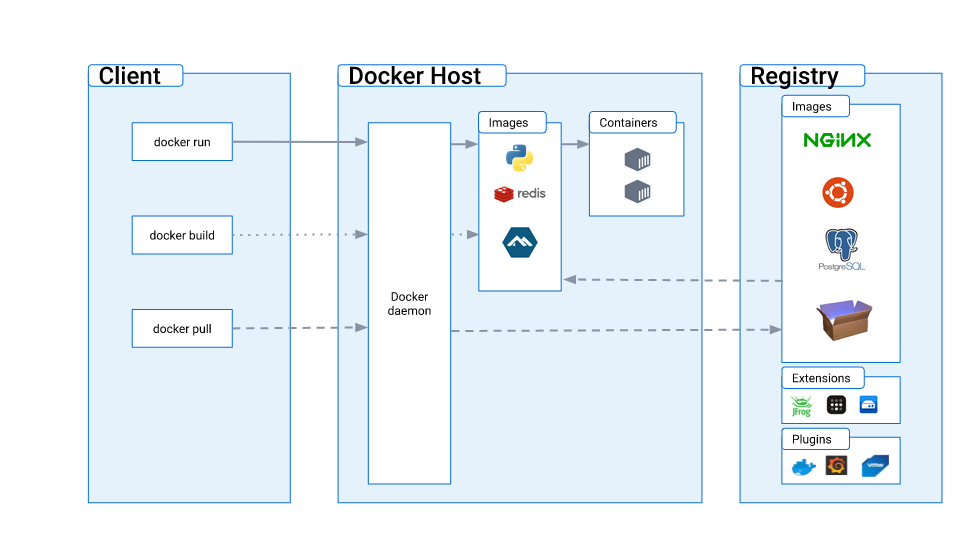

## Docker container

A Docker container is a lightweight, standalone, executable package that includes everything needed to run a piece of software, including the code, a runtime, libraries, environment variables, and configuration files. Docker containers are built from Docker images, which are templates that define the container's contents and behaviors.

#### Docker Run == docker pull + create + start

The `docker run` command is versatile and can be used in many different ways depending on your needs. Here are several examples to illustrate various use cases:

1. **Running a Container Interactively**:
   ```bash
   docker run -it ubuntu /bin/bash
   ```
   This command runs an Ubuntu container and gives you an interactive shell (`/bin/bash`) inside it. The `-it` option makes the container start in interactive mode with a tty.

2. **Running a Container with Environment Variables**:
   ```bash
   docker run -e MY_VAR=myvalue my-image
   ```
   Here, the `-e` flag is used to set an environment variable `MY_VAR` with the value `myvalue` in the container created from `my-image`.

3. **Running a Container with a Volume**:
   ```bash
   docker run -v /my/host/folder:/my/container/folder my-image
   ```
   This mounts the host directory `/my/host/folder` to `/my/container/folder` in the container. Changes to this directory are reflected in both the container and the host.

4. **Running a Container on a Specific Network**:
   ```bash
   docker run --network=my-network my-image
   ```
   This runs a container on a user-defined network `my-network`, allowing it to communicate with other containers on the same network.

5. **Running a Container with a Specific Hostname**:
   ```bash
   docker run --hostname=my-container my-image
   ```
   Sets the hostname of the container to `my-container`.

6. **Running a Container with Custom CPU and Memory Constraints**:
   ```bash
   docker run --cpus=1.5 --memory=512m my-image
   ```
   Limits the container to 1.5 CPUs and 512 megabytes of RAM.

7. **Running a Container and Removing it After Exit**:
   ```bash
   docker run --rm my-image
   ```
   The `--rm` flag automatically removes the container file system upon exit.

8. **Running a Container in Detached Mode with a Name**:
   ```bash
   docker run -d --name my-background-container my-image
   ```
   Runs the container in detached mode (in the background) and names it `my-background-container`.

9. **Running a Container and Publishing Multiple Ports**:
   ```bash
   docker run -p 80:80 -p 443:443 nginx
   ```
   Maps both port 80 and 443 from the container to the same ports on the Docker host, useful for running a web server like Nginx.

10. **Running a Container with a Read-Only File System**:
    ```bash
    docker run --read-only my-image
    ```
    Starts a container where the file system is read-only, which can improve security by preventing changes to system files.

11. **Running a Container with a name**:

```bash
docker run --name my-container my-image
```

12. **Running a Container with -d -i -t**:

```bash
docker run -dit --name nginx2 --expose 443 --expose 445 nginx:latest
```

These examples demonstrate how `docker run` can be used in various scenarios. Depending on your specific use case, you might combine several of these options in a single command. Remember, each Docker image might have its specific requirements and supported options, so always refer to the documentation for the images you are using.


### Docker rm

The `docker rm` command is used to remove one or more Docker containers. It's important to note that only stopped containers can be removed. If you try to remove a running container, you will encounter an error unless you use the `-f` (force) flag, which will stop and then remove the container.

Here's a basic example of the `docker rm` command:

```bash
docker rm my-container
```

In this example, `my-container` is the name or ID of the container you want to remove. You can find the name or ID of your containers by using the `docker ps -a` command, which lists all containers (running and stopped).

Here are a few more examples with different options:

1. **Removing Multiple Containers**:
   ```bash
   docker rm container1 container2 container3
   ```
   This command will remove containers named `container1`, `container2`, and `container3`.

2. **Force Removing a Running Container**:
   ```bash
   docker rm -f running-container
   ```
   The `-f` or `--force` option will stop a running container and then remove it.

3. **Remove a Container Upon Exit**:
   You can also set a container to be automatically removed when it stops by using the `--rm` flag with `docker run`, like so:
   ```bash
   docker run --rm my-image
   ```
   In this case, the container will be removed automatically when it exits. This is useful for keeping your system clean if you frequently create and dispose of temporary containers.

##### Here are more examples of using the `docker rm` command to remove Docker containers:

1. **Remove a Container by ID**:
   ```bash
   docker rm 1c2d3e4f5g
   ```
   In this case, `1c2d3e4f5g` is the ID of the container. Docker IDs are unique identifiers assigned to each container.

2. **Remove Containers Using a Wildcard**:
   ```bash
   docker rm $(docker ps -aq --filter "name=my-container*")
   ```
   This command removes all containers whose names start with `my-container`. The `docker ps -aq` command lists all containers (with the `-a` flag), and the `--filter` option filters them by name. The `-q` flag returns only the container IDs, which are then passed to `docker rm`.

3. **Remove All Stopped Containers**:
   ```bash
   docker rm $(docker ps -aq -f status=exited)
   ```
   This command removes all containers that have a status of "exited". The `-f` flag filters the listed containers by their status.

4. **Remove Containers Created Before a Certain Container**:
   ```bash
   docker rm $(docker ps -aq --before container_id)
   ```
   Here, `container_id` is the ID of a specific container. This command removes all containers that were created before the specified container.

5. **Remove Containers that Exited More Than an Hour Ago**:
   ```bash
   docker rm $(docker ps -aq --filter "status=exited" --filter "since=1h")
   ```
   This command will remove all containers that have been in an exited state for more than an hour.

6. **Remove Containers with a Specific Label**:
   ```bash
   docker rm $(docker ps -aq --filter "label=my-label")
   ```
   Removes all containers that have a specific label assigned to them.

7. **Remove the Most Recently Created Container**:
   ```bash
   docker rm $(docker ps -aq --latest)
   ```
   The `--latest` flag will target the most recently created container.

8. **Remove Containers Except One**:
   ```bash
   docker rm $(docker ps -aq --filter "id!=container_id")
   ```
   This will remove all containers except the one with the specified `container_id`.

Remember, the `docker rm` command only removes containers, not images. If you want to remove images, you would use the `docker rmi` command instead. Also, it's always a good practice to ensure you really want to remove these containers, as this action is irreversible and any unsaved data in the containers will be lost.

### Expose Port in Docker run command

Exposing ports in Docker is a crucial aspect of container configuration, especially when you want to enable communication with the container from the outside world or between containers.

The `-p` flag in the `docker run` command is used to map a network port from the container to your host. This is crucial for accessing applications running inside containers from outside the Docker host. Here are more examples to illustrate different uses of the `-p` flag for exposing ports:

1. **Mapping a Single Port**:
   ```bash
   docker run -p 5000:5000 my-image
   ```
   This maps port 5000 inside the container to port 5000 on the Docker host. Useful for applications like web servers that listen on a single port.

2. **Mapping Multiple Ports**:
   ```bash
   docker run -p 8000:80 -p 2222:22 my-image
   ```
   Here, port 80 inside the container is mapped to port 8000 on the host, and port 22 inside the container is mapped to port 2222 on the host. This setup might be used for a container running a web server and an SSH server.

3. **Mapping a Range of Ports**:
   ```bash
   docker run -p 7000-7005:7000-7005 my-image
   ```
   This maps a range of ports (7000 to 7005) from the container to the same range on the Docker host. Useful for applications that use multiple consecutive ports.

4. **Dynamic Host Port Mapping**:
   ```bash
   docker run -p 80 my-image
   ```
   Docker automatically assigns a free port on the host to port 80 in the container. You can check which port was assigned by running `docker ps` and looking at the "PORTS" column.

5. **Bind to a Specific Host Interface**:
   ```bash
   docker run -p 192.168.1.100:80:80 my-image
   ```
   This binds port 80 in the container to port 80 on a specific interface (`192.168.1.100`) of the Docker host, rather than all interfaces.

6. **Mapping UDP Ports**:
   ```bash
   docker run -p 12345:12345/udp my-image
   ```
   Maps UDP port 12345 inside the container to UDP port 12345 on the Docker host.

7. **Mapping Different Internal and External Ports**:
   ```bash
   docker run -p 8080:80 my-image
   ```
   This maps port 80 inside the container to port 8080 on the Docker host. This is commonly used when the standard ports (like 80 for HTTP) are already in use on the host.

8. **Bind Multiple Ports to the Same Internal Port**:
   ```bash
   docker run -p 8080:80 -p 8081:80 my-image
   ```
   Here, both port 8080 and 8081 on the Docker host are mapped to port 80 in the container. This can be useful for load balancing scenarios.

Remember, when you map ports, the Docker host's firewall settings may affect accessibility. Ensure that the host's firewall allows traffic on the ports you've exposed. Also, Docker port mapping is designed for development and testing. For production deployments, consider using Docker Swarm or Kubernetes, which offer more advanced networking and orchestration features.

#### Docker prune

Certainly! The `docker prune` command comes in handy for efficiently cleaning up unused or dangling Docker objects. Here are examples for each type of prune command, demonstrating their usage and functionality:

```bash
yes | docker container prune
```

### 1. Container Pruning

**Remove all stopped containers**:
```bash
docker container prune
```
This will remove all containers that have been stopped. Docker will ask for confirmation before deletion unless you add the `-f` or `--force` flag.

### 2. Image Pruning

**Remove dangling images** (those that are not tagged and not referenced by any container):
```bash
docker image prune
```

**Remove all unused images (both dangling and unreferenced by any container)**:
```bash
docker image prune -a
```
This is a more aggressive cleanup that will free up more space but may remove images that you intended to use later.

### 3. Volume Pruning

**Remove all unused volumes**:
```bash
docker volume prune
```
This command cleans up volumes not used by at least one container. Be cautious with this command as it may lead to data loss if you accidentally remove volumes containing important data.

### 4. Network Pruning

**Remove all unused networks**:
```bash
docker network prune
```
This will remove all networks not used by at least one container, helping to clean up potentially complex networking setups.

### 5. System-wide Pruning

**Remove stopped containers, dangling images, and unused networks**:
```bash
docker system prune
```

**Remove all unused objects (containers, images, volumes, and networks)**:
```bash
docker system prune -a --volumes
```
This is the most comprehensive cleanup. It removes stopped containers, all unused images (not just dangling ones), all unused volumes, and networks. It's very effective for freeing up space but should be used with caution to avoid unintentional data loss.

### Additional Options

**Force Pruning without Confirmation Prompt**:
Add `-f` or `--force` to any of these commands to bypass the confirmation prompt. This is useful for scripting or automated cleanup tasks:
```bash
docker system prune -af
```

**Filtering**:
You can use filters with prune commands to target specific objects based on criteria like until (time-based), label, etc.:
```bash
docker container prune --filter "until=24h"
```
This command will remove all containers stopped more than 24 hours ago.

Using these commands periodically can help manage disk space and keep your Docker environment clean, especially in development scenarios where frequent changes are made. However, always exercise caution and ensure that you are not removing data or resources that you still need.


#### Docker container inspect

The `docker container inspect` command is used to get detailed information about a Docker container in JSON format. It's particularly useful for retrieving low-level information about the container's configuration, state, network settings, and more. Here are some examples:

1. **Basic Inspect Command**:
   To inspect a container named `mycontainer`, you would use:
   ```bash
   docker container inspect mycontainer
   ```
   This command will output a JSON object with a wealth of information about `mycontainer`.

2. **Filtering for Specific Data with `--format`**:
   If you're only interested in specific information, such as the container's IP address, you can use the `--format` option. For example:
   ```bash
   docker container inspect --format '{{ .NetworkSettings.IPAddress }}' mycontainer
   ```
   This command retrieves only the IP address of `mycontainer`.

3. **Inspecting Multiple Containers**:
   You can inspect multiple containers at once by listing their names or IDs:
   ```bash
   docker container inspect container1 container2 container3
   ```
   This will return detailed information for `container1`, `container2`, and `container3`.

4. **Getting Mounted Volumes Information**:
   To see information about mounted volumes in a container:
   ```bash
   docker container inspect --format '{{ json .Mounts }}' mycontainer
   ```
   This command displays details of all mounts in `mycontainer` in JSON format.

5. **Retrieving Environment Variables**:
   If you need to see the environment variables set in a container:
   ```bash
   docker container inspect --format '{{ range .Config.Env }}{{ println . }}{{ end }}' mycontainer
   ```
   This will list all the environment variables configured in `mycontainer`.

6. **Checking Container’s Health Status**:
   For containers with health checks, you can find out the health status:
   ```bash
   docker container inspect --format '{{ .State.Health.Status }}' mycontainer
   ```
   This returns the health status of `mycontainer`, like `healthy` or `unhealthy`.

7. **Extracting Container Creation Time**:
   To find out when a container was created:
   ```bash
   docker container inspect --format '{{ .Created }}' mycontainer
   ```
   This command shows the creation timestamp of `mycontainer`.

8. **Finding Out the Restart Count**:
   To see how many times a container has been restarted:
   ```bash
   docker container inspect --format '{{ .RestartCount }}' mycontainer
   ```
   This will give you the number of times `mycontainer` has been restarted.

Each of these examples demonstrates how `docker container inspect` can be a powerful tool for getting detailed insights into your Docker containers. Remember to replace `mycontainer`, `container1`, `container2`, etc., with your actual container names or IDs as needed for your specific use cases.

```bash
docker ps -a
```

#### Docker exec

The `docker exec` command is used to run a new command in a running container. It's a powerful tool in Docker's command-line interface, allowing users to interact with or modify containers that are already running. Here's a basic overview of how it works:

- **Basic Syntax**: The basic syntax of the `docker exec` command is `docker exec [OPTIONS] CONTAINER COMMAND [ARG...]`. This means that after specifying the command, you provide options (if needed), the container ID or name where you want to run the command, followed by the command you wish to execute and any arguments it requires.

- **Common Use Cases**:
  - **Running an interactive shell**: You can start an interactive shell inside a running container, like bash or sh, using a command like `docker exec -it <container_name> /bin/bash`. The `-it` flag attaches your terminal input to the shell inside the container.
  - **Executing scripts or commands**: If you want to run a script or a specific command inside a container, you can do so without needing to enter the container's shell. For example, `docker exec <container_name> python script.py` would run a Python script inside the container.
  - **Checking container health**: You might want to check the status of processes in a container, for which you could use something like `docker exec <container_name> ps aux` to view running processes.

- **Options**:
  - `-d`, `--detach`: Run the command in the background.
  - `-i`, `--interactive`: Keep STDIN open even if not attached.
  - `-t`, `--tty`: Allocate a pseudo-TTY, useful for interactive applications.
  - `--env`: Set environment variables.

Remember, any changes you make to a container using `docker exec` are not persistent if the container is deleted. To make persistent changes, you usually need to update the Dockerfile or the image from which the container is created.

```bash
docker exec -it CONTAINER_ID /bin/bash
```

Certainly! Here are more examples of how to use the `docker exec` command in various scenarios:

1. **Running a Shell Command Inside a Container**: 
   Suppose you want to list the contents of the root directory in a running container named `mycontainer`. You would use:
   ```bash
   docker exec mycontainer ls /
   ```
   This command executes `ls /` inside `mycontainer`, listing the contents of its root directory.

2. **Accessing an Interactive Shell**:
   If you need to access a bash shell inside a container named `webapp`:
   ```bash
   docker exec -it webapp /bin/bash
   ```
   This opens an interactive bash shell inside the `webapp` container.

3. **Creating a New File Inside a Container**:
   To create a new text file inside a container:
   ```bash
   docker exec mycontainer touch /tmp/newfile.txt
   ```
   This command uses `touch` to create a new file named `newfile.txt` in the `/tmp` directory of `mycontainer`.

4. **Running a Python Script**:
   If you have a Python script in your container and want to execute it:
   ```bash
   docker exec mycontainer python /path/to/script.py
   ```
   Replace `/path/to/script.py` with the actual path to your Python script inside the container.

5. **Checking Memory Usage**:
   To check the memory usage inside a container:
   ```bash
   docker exec mycontainer free -m
   ```
   This executes the `free -m` command, which shows memory usage in megabytes.

6. **Setting Environment Variables in the Executed Command**:
   You can set environment variables for the command you're running:
   ```bash
   docker exec -e VAR1=value1 mycontainer some-command
   ```
   This sets the environment variable `VAR1` to `value1` before executing `some-command` in `mycontainer`.

7. **Running a Command as a Specific User**:
   You can specify the user that the command should be run as:
   ```bash
   docker exec -u username mycontainer whoami
   ```
   This runs the `whoami` command inside `mycontainer` as `username`.

Each of these examples demonstrates the versatility of `docker exec` in managing and interacting with Docker containers. Remember to replace `mycontainer`, `webapp`, and other placeholders with your actual container names or commands as per your use case.


#### Docker cp

The `docker cp` command is used to copy files or directories between a Docker container and the local filesystem. This command is particularly useful for transferring data to and from containers. Here's a basic overview of how it works:

- **Basic Syntax**:
  The syntax of the `docker cp` command is either `docker cp [OPTIONS] CONTAINER:SRC_PATH DEST_PATH` or `docker cp [OPTIONS] SRC_PATH CONTAINER:DEST_PATH`. This means you can copy files from the local filesystem to a container or from a container to the local filesystem.

- **Copying from Container to Host**:
  To copy a file or directory from a container to the host, you specify the container name followed by a colon and the path to the file or directory inside the container, and then the path where you want to copy it on your host.
  Example: 
  ```bash
  docker cp mycontainer:/path/to/file/in/container /path/on/host
  ```
  This command copies a file from `mycontainer` to a specified path on the host.

- **Copying from Host to Container**:
  To copy a file or directory from your host to a container, you specify the path on the host and then the container name followed by a colon and the path inside the container where you want to copy it.
  Example:
  ```bash
  docker cp /path/on/host mycontainer:/path/to/destination/in/container
  ```
  This command copies a file from the host to a specified path inside `mycontainer`.

- **Options**:
  - `-a`, `--archive`: Archive mode (copies all file attributes).
  - `-L`, `--follow-link`: Always follow symbol link in SRC_PATH.

- **Important Considerations**:
  - The `docker cp` command does not require the container to be running. You can copy files to and from stopped containers as well.
  - When copying folders, Docker copies all subdirectories and files recursively.
  - File ownership and permissions can be affected by the host system's user and group IDs.

The `docker cp` command is very handy for quick file transfers, but for more complex or frequent file synchronization needs, it's usually better to use Docker volumes.