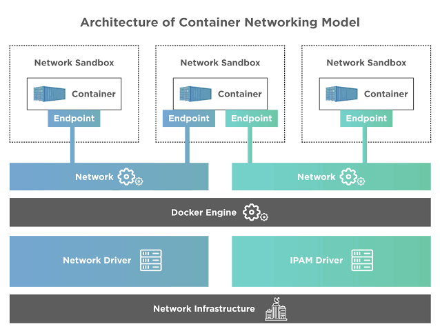

## Docker Network

The Container Network Model (CNM) is a standard, proposed by Docker, designed to provide a general framework for networking in containerized environments. It aims to simplify and standardize how containers communicate with each other and with the outside world. The CNM is part of Docker's broader effort to make container technologies more accessible and easier to use, particularly in complex, multi-container environments. Here are the key components and concepts of the CNM:

1. **Network Sandbox**: A network sandbox holds the configuration of a container's network stack. This includes the container's network interfaces, routing table, and DNS settings. Each container has its own network sandbox.

2. **Endpoint**: An endpoint joins a network sandbox to a network. It represents a network interface within the container. A container can have multiple endpoints connected to different networks, allowing it to communicate across these networks.

3. **Network**: A network is a group of endpoints that can communicate directly with each other. In the CNM, networks are isolated from each other, meaning that containers on different networks cannot communicate unless explicitly allowed. Networks can be created with different drivers, allowing for different kinds of networking behavior, such as overlay networking for communication across different hosts or physical networking for high performance.

4. **Network Driver**: Network drivers provide the underlying technology that powers the networks. Docker supports several built-in network drivers (like bridge, overlay, and macvlan) and allows for third-party drivers through its plugin system. Each driver offers different features and is suitable for different use cases.

The CNM provides a flexible and extensible framework for container networking. It allows users to create complex, multi-host network configurations, supports network segmentation and isolation, and integrates with external networking solutions through plugins. The CNM's design is focused on simplicity, aiming to make it as straightforward as possible for users to connect their containers in a way that suits their application's architecture and security requirements.

### ipam driver

In the context of the Container Network Model (CNM) used by Docker and other container technologies, an IPAM (IP Address Management) driver is responsible for IP address management within container networks. The IPAM driver allocates IP addresses to containers and manages the IP address space for networks, ensuring that each container has a unique IP address and that address conflicts are avoided. It plays a crucial role in the network configuration and operation of containers, enabling seamless communication between containers, as well as between containers and external networks.

Key functions of an IPAM driver include:

1. **IP Address Allocation**: When a container is created or connected to a network, the IPAM driver allocates an IP address to it. The allocation is based on the network's address space and existing allocations to ensure no two containers have the same IP address within the same network.

2. **Subnet Management**: The IPAM driver manages subnets within each network, defining how the IP address space is divided and used. This includes determining the subnet mask and gateway for each subnet, which is crucial for routing traffic between containers and between containers and the outside world.

3. **Address Space Management**: For networks that span multiple hosts, the IPAM driver manages the distribution of IP address space across these hosts, ensuring that address allocations are consistent and non-conflicting across the cluster.

4. **DNS Configuration**: Some IPAM drivers also assist in managing DNS settings for containers, ensuring that containers can resolve each other's names and communicate effectively.

Docker, for example, comes with a default IPAM driver but also allows users to plug in custom IPAM drivers that can offer more advanced features or integration with external IPAM systems. This flexibility allows users to tailor their network management to the specific needs of their deployment, whether they're running a simple, single-host setup or a complex, multi-host environment.

By abstracting away the complexities of IP address management, IPAM drivers play a critical role in making container networking as automatic and frictionless as possible, enabling users to focus on building and scaling their applications instead of managing network details.

