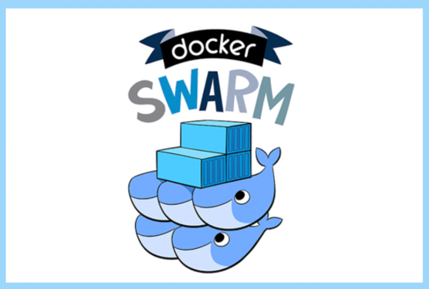

# What is docker swarm

Docker Swarm is a container orchestration platform provided by Docker. It allows you to create and manage a cluster of Docker hosts, and deploy and scale containerized applications across the cluster. Docker Swarm provides features such as service discovery, load balancing, rolling updates, and high availability for containers. It is designed to be easy to use and integrates seamlessly with Docker's existing tools and ecosystem.

## Prerequisites

- Docker
- Docker Compose
- Docker Machine

## Docker Swarm architecture

Docker Swarm is a container orchestration tool, which means it allows you to manage multiple Docker hosts as a single virtual system. It's designed to work around four key components, which together provide a streamlined way to deploy, scale, and manage containerized applications. Here's a breakdown of Docker Swarm's architecture and its main components:

1. **Swarm Manager Nodes:**
   - These nodes are responsible for the entire Swarm and handle the orchestration and cluster management tasks. They make decisions about which node runs a container, handle the desired state of the Swarm, and schedule services. There are two types of Swarm managers:
     - **Leader:** Handles all orchestration and management tasks for the Swarm.
     - **Reachable and Unreachable Managers:** Additional manager nodes that can take over if the leader fails.

2. **Worker Nodes:**
   - Worker nodes are responsible for running containerized applications as specified by the Swarm manager. They communicate with the manager nodes to report on the status of tasks assigned to them but do not make scheduling decisions.

3. **Services and Tasks:**
   - **Service:** A service is the definition of the tasks to execute on the Docker Swarm. It defines the container image, ports, and the policy used to scale, update, or roll back the application.
   - **Task:** A task carries a Docker container and commands to run inside the container. It is the smallest unit of deployment, such as a single container running in a Docker Swarm, and is assigned to a node by a Swarm manager.

4. **Registry:**
   - A Docker registry stores Docker images. Docker Swarm nodes communicate with the registry to pull images to run as containers. The most common example of a registry is Docker Hub, but you can also set up your own private registry.

5. **Networking:**
   - Docker Swarm supports overlay networking for services, enabling secure, container-to-container communication across nodes. This is crucial for allowing containers to communicate with each other and for enabling the routing mesh, which makes services accessible from any node regardless of whether they're running on that node.

6. **Routing Mesh:**
   - The routing mesh is a feature that routes requests to the appropriate containers, even if they're not on the node that receives the request. It ensures that every node in the Swarm can accept requests for any service running in the Swarm, thus providing high availability and load balancing.

7. **Swarm Mode:**
   - When Docker runs in Swarm mode, it operates in a cluster management and orchestration features. This mode integrates the functionality of managing a cluster of Docker engines into a single, virtual Docker engine.

In summary, Docker Swarm's architecture simplifies the process of deploying and managing multi-container applications at scale. It uses a combination of manager nodes for orchestration, worker nodes for running applications, services, and tasks for application deployment, and integrated networking and service discovery mechanisms to ensure applications are highly available and accessible.

