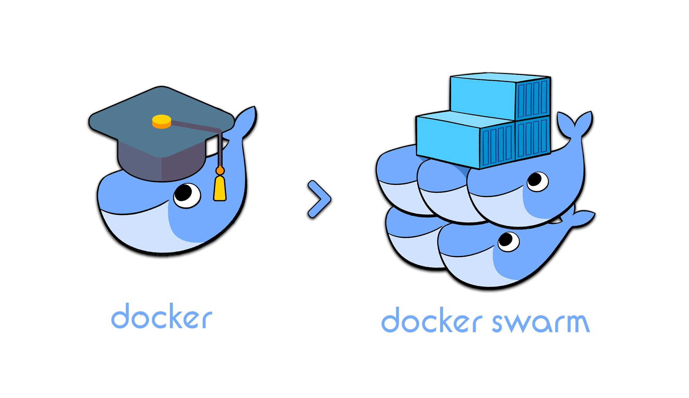

# Install Docker Swarm

Installing Docker Swarm involves initializing a swarm, which is a cluster of Docker engines, and then joining additional nodes to the swarm as managers or workers. Docker Swarm is a part of the Docker Engine, so if you have Docker installed, you already have the tools necessary to start a swarm. Here's a step-by-step guide to setting up a basic Docker Swarm cluster.

#### We have tow kind of command for docker swarm

1. `docker swarm`: for manage node and worker node
2. `docker service`: for manage service and application

### Step 1: Install Docker

Ensure Docker is installed on all machines that you want to include in your swarm. The installation steps may vary depending on your operating system. You can find detailed instructions on Docker's official website. Generally, Docker installation commands are specific to the operating system you are using (Linux, Windows, macOS).

https://docs.docker.com/engine/install/ubuntu/

### Step 2: Initialize the Swarm

Select one of your machines to be the manager node. A Docker Swarm can have multiple managers, but for simplicity, you can start with one. On this machine, run the following command:

```sh
docker swarm init --advertise-addr <MANAGER-IP>
```

Replace `<MANAGER-IP>` with the IP address of the machine you're using as the manager. This command initializes a new swarm and makes your current machine the manager node. The `--advertise-addr` flag specifies the address other nodes will use to join the swarm.

After running the command, you will receive a response that includes a `docker swarm join` command with a token. Keep this command handy, as you will need it to join worker nodes to the swarm.

### Step 3: Join Worker Nodes to the Swarm

On each machine that you want to add to the swarm as a worker, run the `docker swarm join` command that was output when you initialized the swarm on the manager node. It looks something like this:

```sh
docker swarm join --token <SWARM-TOKEN> <MANAGER-IP>:2377
```

Ensure to replace `<SWARM-TOKEN>` with the actual token provided by the manager node and `<MANAGER-IP>` with the IP address of the manager node.

### Step 4: Verify the Swarm

After all nodes have joined the swarm, you can run the following command on the manager node to list all the nodes in the swarm:

```sh
docker node ls
```

### Leave the Swarm

You can leave the swarm by running the following command:

```sh
docker swarm leave
```

### Promote Worker Nodes to Manager Nodes

You can promote worker nodes to be manager nodes by running the following command:

```sh
docker node promote <WORKER-NODE-NAME>
```

### Inspect the Swarm

You can inspect the swarm by running the following command:

```sh
docker node ls
```

### Show all continents of the Swarm

You can show all the continents in the swarm by running the following command:

```sh
docker node ps
```

### Remove node from the Swarm

You can remove a node from the swarm by running the following command:

```sh
docker node rm <NODE-NAME>
```

### Join new nodes to the Swarm

You can join new nodes to the swarm by running the following command:

```sh
docker swarm join-token --help

docker swarm join-token worker

docker swarm join-token manager

```

###### What is docker swarm unlock? it's your task :)

### Docker unlock

You can unlock the swarm by running the following command:

```sh
docker swarm unlock
```


This command displays all the nodes in the swarm, including their roles (manager or worker), status, and other details.

### Additional Steps and Considerations

- **Adding Manager Nodes**: For high availability, you can promote worker nodes to be additional manager nodes. Use the `docker node promote` command.
- **Security and Networking**: Consider configuring firewalls and network settings to ensure your swarm operates securely. You might also want to use Docker's overlay network for container communication across multiple hosts.
- **Docker Engine Version**: Ensure all nodes are running the same version of Docker to avoid compatibility issues.
- **Maintenance and Scaling**: Monitor your swarm, scale services as needed, and perform regular maintenance tasks to keep the cluster healthy.

That's it! You have set up a basic Docker Swarm cluster. From here, you can start deploying and scaling your containerized applications across the swarm.