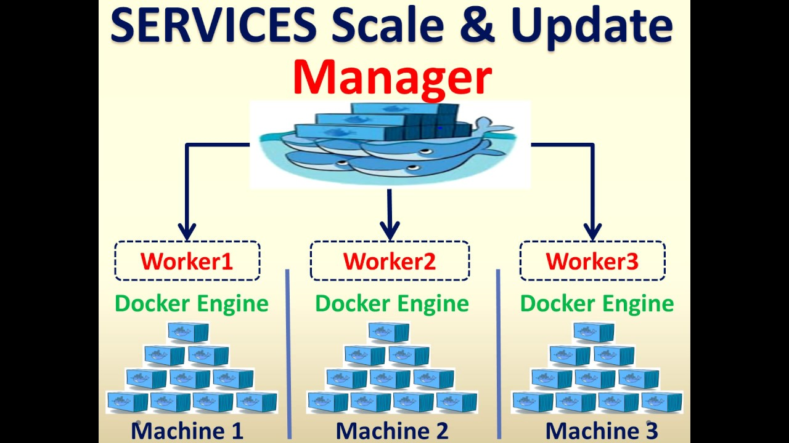

Docker Swarm Services are a key concept in Docker Swarm mode, enabling you to deploy, scale, and manage a set of containers across a cluster of Docker hosts. A service in Docker Swarm allows you to define the desired state of your application or a component of your application that runs on the Swarm cluster. Here’s an overview of how services work in Docker Swarm and how you can use them:

### What is a Docker Swarm Service?

A Docker Swarm service abstracts the way you run your application containers on a cluster of Docker nodes. It allows you to specify not only which container image to use and how many instances of that container should be running but also how the containers should behave—such as network configurations, storage options, and update policies—ensuring your application runs exactly as you’ve specified across your cluster.

### Key Features of Docker Swarm Services:

1. **Scalability**: Easily scale a service up or down using simple commands to increase or decrease the number of container instances (replicas) running in the swarm.

2. **Load Balancing**: Docker Swarm automatically distributes service instances among the nodes in the cluster. It also comes with an internal load balancer that can distribute network traffic among the instances of a service.

3. **Rolling Updates and Rollbacks**: Apply updates to your service without downtime. Docker Swarm can gradually update service instances across the cluster, ensuring high availability. If something goes wrong, you can rollback to the previous version of the service.

4. **Self-healing**: Docker Swarm monitors the health of nodes and services. If a container in a service fails, Swarm automatically restarts it on a healthy node to maintain the desired state.

5. **Service Discovery**: Services can discover each other through Docker's internal DNS server. Each service in the swarm gets a unique DNS name, allowing for inter-service communication without hardcoding container IP addresses.

### Creating and Managing Docker Swarm Services:

To create a service in Docker Swarm, you use the `docker service create` command with various options to define your service. Here’s a basic example:

```sh
docker service create --name my-web-app --replicas 3 -p 80:80 my-image:latest
```

This command creates a service named `my-web-app`, based on the `my-image:latest` Docker image. It starts 3 replicas of the container and maps port 80 on the host to port 80 in the containers.

To manage services, Docker provides several commands:

- **List Services**: `docker service ls`
- **Inspect a Service**: `docker service inspect --pretty <service-name>`
- **Scale a Service**: `docker service scale <service-name>=<num-replicas>`
- **Update a Service**: `docker service update --image <new-image>:<tag> <service-name>`
- **Remove a Service**: `docker service rm <service-name>`


### Docker Swarm Service commands:

```sh
docker service create --name nginx1 nginx:latest
```

list services

```sh
docker service ls
```

```sh
docker service ps nginx1
```

scale service

```sh
docker service scale nginx1=2
```

Inspect service

```sh
docker service inspect nginx1
```

## More example

Certainly! Below are examples of Docker service commands with various options (switches) that demonstrate different capabilities and configurations for deploying and managing services in a Docker Swarm environment. These examples expand on the basic `docker service create` command by introducing additional functionality such as environment variables, mounting volumes, and specifying network options.

### 1. Deploy a Service with Environment Variables

Deploy a Redis service and set an environment variable (`REDIS_PASSWORD`) for the Redis instance:

```sh
docker service create \
  --name my-redis \
  --replicas 2 \
  --env REDIS_PASSWORD=strongpassword123 \
  redis:latest
```

- `--env`: Sets environment variables for the containers.

### 2. Deploy a Service with a Mounted Volume

Deploy a PostgreSQL database service with a volume for persistent data storage:

```sh
docker service create \
  --name my-postgres \
  --replicas 1 \
  --mount type=volume,source=my-postgres-data,target=/var/lib/postgresql/data \
  --env POSTGRES_PASSWORD=strongpassword123 \
  postgres:latest
```

- `--mount`: Specifies the mount configuration for the service. This example creates a volume named `my-postgres-data` that persists data stored in `/var/lib/postgresql/data` inside the container.

### 3. Deploy a Service on a Specific Overlay Network

Deploy an Apache web server service and attach it to a custom overlay network named `my-web-net`:

```sh
docker service create \
  --name my-apache \
  --replicas 3 \
  --network my-web-net \
  --publish published=8080,target=80 \
  httpd:latest
```

- `--network`: Connects the service to a specified network. In this case, `my-web-net` is an overlay network that allows inter-service communication in a distributed manner.

### 4. Deploy a Service with Resource Constraints

Deploy a Node.js application with specific CPU and memory constraints:

```sh
docker service create \
  --name my-node-app \
  --replicas 2 \
  --limit-cpu 0.5 \
  --limit-memory 256M \
  --publish published=3000,target=3000 \
  my-node-app:latest
```

- `--limit-cpu` and `--limit-memory`: Restrict the amount of CPU and memory resources available to each service instance. This example limits each instance to 0.5 CPUs and 256MB of memory.

### 5. Deploy a Service with a Rolling Update Policy

Deploy a service with a specific update policy, which controls how updates to the service are rolled out:

```sh
docker service create \
  --name my-web-service \
  --replicas 4 \
  --publish published=80,target=80 \
  --update-parallelism 2 \
  --update-delay 10s \
  nginx:latest
```

- `--update-parallelism`: Specifies the number of service tasks that can be updated simultaneously.
- `--update-delay`: Sets the delay between updates to different tasks (e.g., waiting 10 seconds between updating each set of tasks).

### 6. Deploy a Service with Placement Constraints

Deploy a service that should only run on nodes with a specific label (e.g., `ssd=true`):

```sh
docker service create \
  --name my-fast-storage-service \
  --replicas 2 \
  --constraint 'node.labels.ssd == true' \
  alpine:latest \
  ping docker.com
```

- `--constraint`: Ensures that service tasks are scheduled on nodes that meet the specified constraints. This command only schedules tasks on nodes labeled with `ssd=true`.

These examples showcase the flexibility and power of Docker Swarm services, demonstrating how you can customize deployments to fit your specific requirements for environment configuration, persistence, networking, resource usage, update strategies, and node placement.