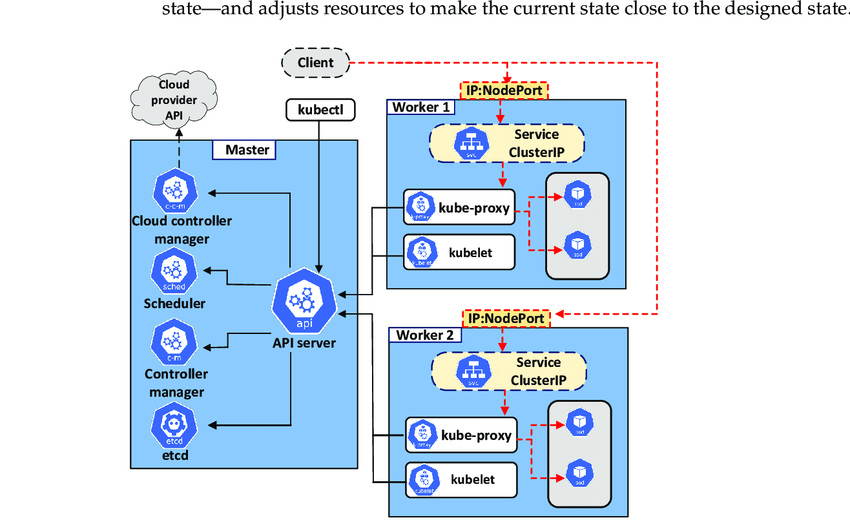

## Kubernetes Architecture

Kubernetes has a complex but well-organized architecture designed to manage the lifecycle of containerized applications and services across a distributed computing environment. Here’s a detailed breakdown of the Kubernetes architecture:

### 1. Kubernetes Cluster
A Kubernetes cluster consists of at least one master node and multiple worker nodes. These nodes can be physical or virtual machines.

### 2. Master Node
The master node is responsible for managing the state of the cluster. Key components of the master node include:

- **API Server (kube-apiserver)**: This is the front end of the Kubernetes control plane and acts as the gateway through which all internal cluster communications pass. It processes REST requests, validates them, and updates the corresponding objects in the etcd database.

- **etcd**: A highly available key-value store used to store all data needed to manage the cluster state. It serves as the "single source of truth" for the cluster.

- **Scheduler (kube-scheduler)**: Responsible for assigning new work, such as Pods, to nodes based on resource availability, policies, affinity specifications, and other criteria.

- **Controller Manager (kube-controller-manager)**: Runs controller processes, which are background threads that handle routine tasks in the cluster. Examples include the Node Controller (which notices and responds when nodes go down), the Replication Controller (which maintains the correct number of pods for every replication group), and more.

- **Cloud Controller Manager (cloud-controller-manager)**: Lets you link your cluster into your cloud provider’s API, and separates out the components that interact with that cloud platform from components that just interact with your cluster.

### 3. Worker Nodes
Worker nodes are the machines that run applications and cloud workflows. The main components of a worker node include:

- **Kubelet**: An agent that runs on each node in the cluster. It makes sure that containers are running in a Pod.

- **Kube-Proxy**: Maintains network rules on nodes. These network rules allow network communication to your Pods from network sessions inside or outside of your cluster.

- **Container Runtime**: The software that is responsible for running containers. Kubernetes supports several container runtimes: Docker, containerd, CRI-O, and any implementation of the Kubernetes CRI (Container Runtime Interface).

### 4. Add-ons
These are components that provide additional features and functionalities to Kubernetes clusters:

- **DNS**: All Kubernetes clusters should have cluster DNS, as many examples rely on DNS for service discovery.

- **Web UI (Dashboard)**: Kubernetes Dashboard is a general-purpose, web-based UI for Kubernetes clusters.

- **Container Resource Monitoring**: Records generic time-series metrics about containers in a central database, and provides a UI for browsing that data.

- **Cluster-Level Logging**: Responsible for saving logs to a central log store with search/browsing interface.

### Communication Flow
- **Control Plane to Node**: The API server communicates with kubelet to manage Pods and services.
- **Node to API Server**: Nodes communicate with the API server to register themselves and send heartbeat messages using the Kubelet.
- **Front End to Backend**: Clients can communicate directly with the API server for operations like starting a Pod or viewing logs.

This architecture not only supports high availability and scalability but also provides the flexibility to grow with complex applications and evolving infrastructure needs.