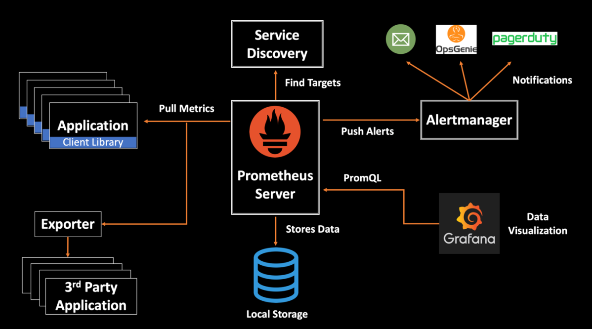

Prometheus is a powerful and flexible monitoring and alerting system, designed with a modular architecture that allows it to be highly scalable and reliable. Its architecture consists of several components that work together to collect, store, query, and visualize metrics. Here's an overview of the key components of Prometheus architecture:

### 1. **Prometheus Server:**
   - **Core Functionality:** The Prometheus server is the heart of the Prometheus ecosystem. It is responsible for scraping metrics from configured targets, storing the time series data in a local database, and processing queries using Prometheus Query Language (PromQL).
   - **Components:**
     - **Scrape Manager:** Manages the scraping process, including scheduling and executing metric collection from endpoints.
     - **Time Series Database (TSDB):** Stores all the collected metrics in a time-series format. Prometheus uses a custom database optimized for high performance in time series data storage and retrieval.
     - **Query Engine:** Evaluates PromQL queries to retrieve and process data, which can be used for alerts, dashboards, or direct data analysis.

### 2. **Exporters:**
   - **Purpose:** Exporters are standalone services that collect and expose metrics from third-party systems (e.g., databases, operating systems, or applications) in a format that Prometheus can scrape.
   - **Examples:**
     - **Node Exporter:** Exposes hardware and OS metrics (like CPU, memory, disk usage).
     - **MySQL Exporter:** Exposes metrics from MySQL databases.
     - **Blackbox Exporter:** Allows probing of endpoints for HTTP, TCP, DNS, and other protocols.

### 3. **Service Discovery:**
   - **Purpose:** Service discovery mechanisms allow Prometheus to automatically detect targets that it should monitor, rather than relying on a static list.
   - **Methods:**
     - **Kubernetes:** Prometheus can automatically discover services running in a Kubernetes cluster.
     - **Consul, DNS, and others:** Prometheus can integrate with various service discovery mechanisms to find endpoints.

### 4. **Alertmanager:**
   - **Purpose:** The Alertmanager handles alerts generated by the Prometheus server. It manages alert notifications and can route, group, silence, and deduplicate alerts before sending them to the appropriate channels (e.g., email, Slack, PagerDuty).
   - **Alerting Rules:** Alerts are defined within Prometheus using PromQL expressions. When these conditions are met, alerts are sent to the Alertmanager.

### 5. **Pushgateway:**
   - **Purpose:** The Pushgateway allows short-lived jobs to push their metrics to Prometheus. This is useful in scenarios where it is difficult or inefficient to have Prometheus directly scrape the job's metrics (e.g., batch jobs).
   - **Functionality:** Jobs push metrics to the Pushgateway, and Prometheus scrapes metrics from the Pushgateway.

### 6. **PromQL (Prometheus Query Language):**
   - **Purpose:** PromQL is a powerful query language used to query the time series data stored in Prometheus. It supports filtering, aggregation, and arithmetic operations on metrics, enabling complex queries and the creation of custom alerts.

### 7. **Storage:**
   - **Local Storage:** Prometheus uses local storage on disk, optimized for time series data, allowing for high-performance reads and writes.
   - **Remote Storage (Optional):** For long-term storage or in cases where local disk space is insufficient, Prometheus can be configured to send data to remote storage backends (e.g., Thanos, Cortex, InfluxDB).

### 8. **Visualization:**
   - **Grafana Integration:** While Prometheus has basic visualization capabilities, it is often integrated with Grafana, a popular open-source platform for monitoring and observability. Grafana can query Prometheus using PromQL and display metrics on customizable dashboards.
   - **Prometheus Web UI:** Prometheus includes a built-in web interface for querying and graphing data, managing targets, and viewing the status of the system.

### 9. **Federation (Optional):**
   - **Purpose:** Federation allows you to scale Prometheus by having multiple Prometheus servers scrape each other’s data. This can be useful in large, distributed environments where you want to aggregate data from multiple Prometheus instances.

### **Prometheus Architecture Diagram:**
```plaintext
             +--------------------+                   +---------------------+
             |    Service 1        |                   |    Service 2         |
             | (Application, DB)   |                   | (Application, DB)    |
             +----------+----------+                   +----------+-----------+
                        |                                     |
                (Metrics Exposed)                      (Metrics Exposed)
                        |                                     |
             +----------v----------+                   +------v------------+
             |      Exporter       |                   |     Exporter       |
             | (e.g., Node Exporter)|                   | (e.g., MySQL Exporter)|
             +----------+-----------+                  +----------+-----------+
                        |                                      |
               (Metrics Collected)                      (Metrics Collected)
                        |                                      |
             +----------v-----------+                  +-------v-------------+
             |    Prometheus Server  |<-- Scrape ------>|  Prometheus Server   |
             |  (Scrape Manager, TSDB)|                | (Remote, if Federated)|
             +----------+-----------+                  +----------+-----------+
                        |                                      |
                   (PromQL Queries)                        (PromQL Queries)
                        |                                      |
             +----------v-----------+                  +-------v-------------+
             |      Alertmanager    |                  |      Grafana         |
             | (Alert Routing, Grouping)|              |   (Visualization)    |
             +----------+-----------+                  +----------------------+
                        |
                (Alert Notifications)
                        |
         +--------------v---------------+
         | (Email, Slack, PagerDuty, etc.)|
         +--------------------------------+

```

### **Summary:**
Prometheus’s architecture is designed for flexibility, reliability, and scalability. It excels in monitoring dynamic and cloud-native environments, making it a popular choice for organizations using microservices, containers, and Kubernetes. The modular nature of Prometheus allows it to be tailored to various use cases, from simple setups to complex, distributed systems.